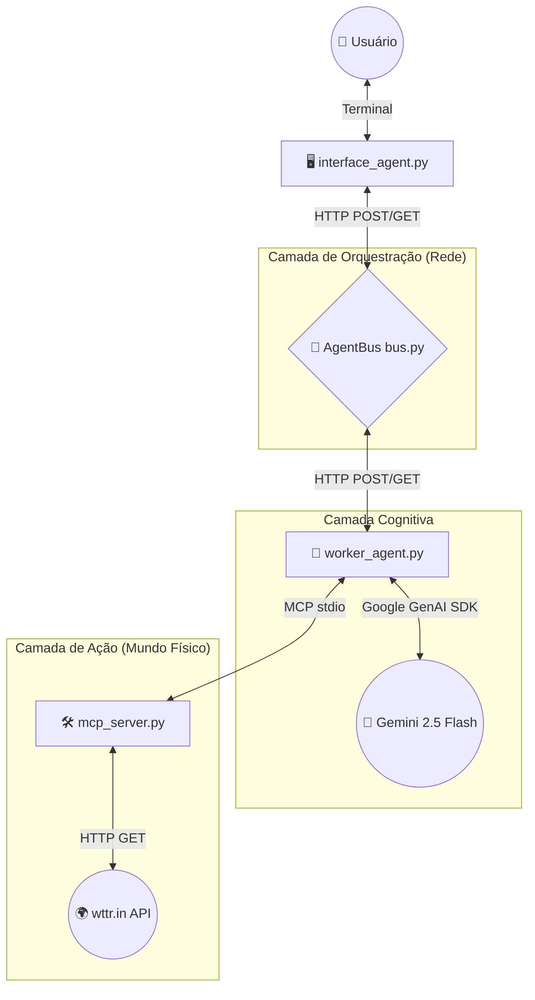

# 🏛️ Arquitetura do Sistema: AgentBus + MCP

Este documento detalha a arquitetura, os componentes, o fluxo de dados e as decisões técnicas por trás do nosso Sistema Multi-Agentes (MAS). O projeto foi construído sob o paradigma de que **"IAs devem ser tratadas como microsserviços"**, separando o raciocínio (LLM), a execução de tarefas (MCP) e a comunicação (AgentBus).

---

## 🧩 1. Visão Geral da Arquitetura

O sistema abandona o modelo monolítico tradicional de chat em favor de uma rede distribuída. Ele se apoia em dois pilares fundamentais:
1. **AgentBus:** Um barramento de mensageria leve que permite a comunicação assíncrona entre diferentes agentes (Interface ↔ Worker).
2. **Model Context Protocol (MCP):** Um padrão aberto de interface cliente-servidor que isola a execução de ferramentas e o acesso a dados do raciocínio da IA.

### 📊 Diagrama de Blocos

---

## 📦 2. Componentes do Sistema

O projeto é dividido em quatro componentes independentes e de responsabilidade única.

### A. O Roteador: `bus.py` (AgentBus)
- **Papel:** O "Correio" central do sistema. Não possui inteligência ou regras de negócio.
- **Funcionamento:** Expõe uma API RESTful. Recebe mensagens via `POST /send` e as armazena em filas (dicionários em memória). Permite que os agentes consumam suas filas via `GET /poll/{agent_id}`.
- **Tecnologias:** `FastAPI`, `Uvicorn`, `Pydantic`.

### B. A Interface: `interface_agent.py` (Agente Atendente)
- **Papel:** O intermediário entre o usuário humano e a rede de IAs.
- **Funcionamento:** Captura o *input* do terminal, empacota em um JSON com remetente (`atendente`) e destinatário (`meteorologista`), envia para o barramento e faz *polling* aguardando a resposta processada para exibi-la na tela.
- **Tecnologias:** `asyncio`, `httpx`.

### C. O Cérebro: `worker_agent.py` (Agente Especialista)
- **Papel:** O núcleo de inteligência da aplicação. É responsável por orquestrar o padrão **ReAct** (Raciocínio e Ação).
- **Funcionamento:** 1. Ouve o AgentBus por novas tarefas.
  2. Acorda o Servidor MCP local via subprocesso (`stdio`).
  3. Envia os prompts ao LLM, decidindo quando extrair parâmetros, quando acionar ferramentas do MCP e como sintetizar a resposta final em linguagem natural.
- **Tecnologias:** `google-genai` (Gemini API), `mcp` (ClientSession, stdio), `python-dotenv`.

### D. As Mãos: `mcp_server.py` (Servidor MCP)
- **Papel:** A ponte segura entre a IA e os sistemas externos.
- **Funcionamento:** Registra ferramentas declarativas (com Docstrings e Type Hints que o MCP converte para JSON Schema automaticamente). Quando invocado pelo Cliente MCP (Worker), executa código Python determinístico, faz chamadas a APIs de terceiros e devolve os dados brutos estruturados.
- **Tecnologias:** `mcp` (FastMCP), `httpx` (para requisições assíncronas externas).

---

## 🔄 3. Fluxo de Processamento (Ciclo de Vida)

Caminho percorrido quando o usuário digita: *"Qual o clima em Tóquio?"*

1. **Ingestão:** O `interface_agent` lê o terminal e faz um `POST` no `AgentBus` direcionado ao `meteorologista`.
2. **Descoberta:** O `worker_agent`, no seu ciclo de *polling* (a cada 2s), encontra a mensagem no `AgentBus` e a consome.
3. **Raciocínio (LLM - Passo 1):** O `worker_agent` pede ao Gemini para extrair a entidade de localização da frase. O Gemini retorna: `"Tóquio"`.
4. **Atuação (MCP):** O `worker_agent` chama localmente a ferramenta `get_weather("Tóquio")` no `mcp_server`.
5. **Integração Externa:** O `mcp_server` faz uma requisição HTTP real para `https://wttr.in/Tóquio?format=j1`, filtra o JSON massivo e devolve apenas Temperatura, Sensação e Condição ao Worker.
6. **Síntese (LLM - Passo 2):** O `worker_agent` envia os dados brutos e a pergunta original de volta ao Gemini, solicitando uma resposta amigável.
7. **Devolução:** O `worker_agent` publica a resposta final no `AgentBus`, direcionada ao `atendente`.
8. **Exibição:** O `interface_agent` encontra a resposta no barramento e a imprime no terminal.

---

## 🛠️ 4. Stack Tecnológica e Infraestrutura

A stack foi escolhida com foco em modernidade, baixa latência e Experiência do Desenvolvedor (DX).

| Camada | Tecnologia | Propósito |
| :--- | :--- | :--- |
| **Gerenciador de Pacotes** | `uv` (Astral) | Substitui pip/virtualenv. Resolução de dependências ultrarrápida. |
| **Orquestração Local** | `honcho` + `taskipy` | Permite rodar a rede de serviços com comandos simples (`task dev`). |
| **Comunicação Web** | `FastAPI` + `httpx` | Barramento HTTP de alta performance e requisições assíncronas. |
| **Protocolo de Integração** | `MCP` (Anthropic SDK) | Padroniza a descoberta e execução de ferramentas (`FastMCP` + `stdio`). |
| **Motor de IA (LLM)** | `Gemini 2.5 Flash` | Modelo multimodal do Google, via biblioteca nativa `google-genai`. |

---

## 💡 5. Princípios de Design Aplicados

* **Desacoplamento Extremo:** O LLM não sabe de onde vêm os dados climáticos. A Interface não sabe qual LLM está respondendo. O Barramento não sabe o conteúdo da mensagem. Tudo pode ser substituído modularmente.
* **Segurança por Isolamento (Princípio do Menor Privilégio):** O LLM nunca executa código arbitrário. Ele apenas solicita a execução de ações estritamente tipadas e mapeadas no Servidor MCP isolado.
* **Complexidade Oculta:** O uso do protocolo `stdio` para o MCP elimina a necessidade de gerenciar portas de rede ou firewalls para serviços que rodam na mesma máquina.