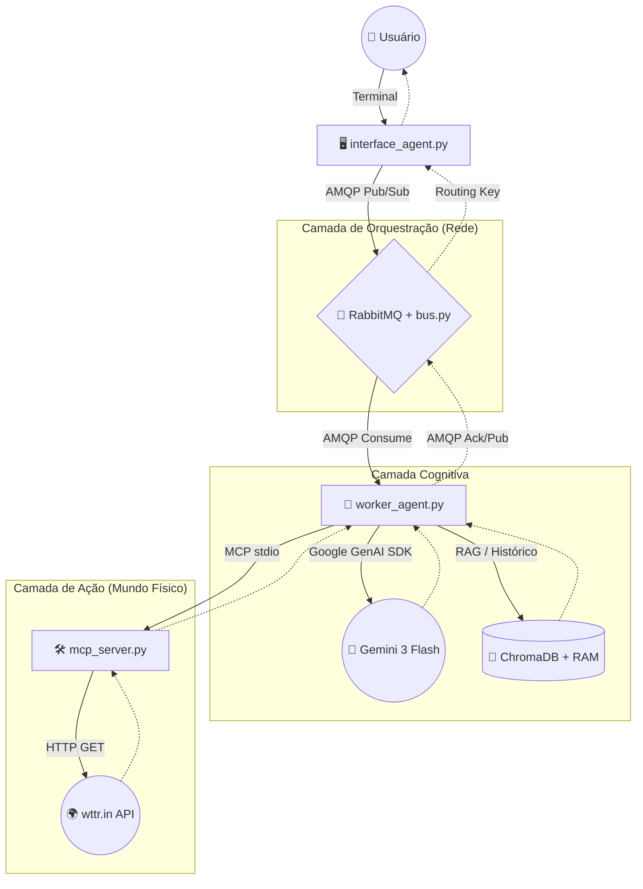

# 🏛️ Arquitetura do Sistema: AgentBus + MCP

Este documento detalha a arquitetura, os componentes, o fluxo de dados e as decisões técnicas por trás do nosso Sistema Multi-Agentes (MAS). O projeto foi construído sob o paradigma de que **"IAs devem ser tratadas como microsserviços"**, separando o raciocínio (LLM), a execução de tarefas (MCP), a comunicação (AgentBus via RabbitMQ) e a retenção de contexto (Memória Cognitiva).

---

## 🧩 1. Visão Geral da Arquitetura

O sistema abandona o modelo monolítico tradicional de chat em favor de uma rede distribuída, contextual e multiusuário. Ele se apoia em três pilares fundamentais:
1. **AgentBus (RabbitMQ):** Um barramento de mensageria assíncrono e resiliente baseado em AMQP, que isola as sessões dos usuários e roteia tarefas entre IAs.
2. **Model Context Protocol (MCP):** Um padrão aberto de interface cliente-servidor que isola a execução de ferramentas e o acesso a dados do raciocínio da IA.
3. **Memória Cognitiva (RAG):** Um sistema duplo de retenção em RAM (curto prazo) e Banco Vetorial (longo prazo) para garantir conversas contínuas e personalizadas.

### 📊 Diagrama de Blocos

---

## 📦 2. Componentes do Sistema

O projeto é dividido em quatro componentes independentes e de responsabilidade única.

### A. O Orquestrador: `bus.py` (AgentBus / RabbitMQ Setup)
- **Papel:** Configura a topologia da rede de mensageria (Exchanges, Filas e Dead Letter Queues) via padrão de ciclo de vida (`lifespan`) e serve de ponte RESTful de fallback.
- **Funcionamento:** Garante que a infraestrutura do RabbitMQ (`agents_exchange`, `agents_dlx`, etc.) esteja declarada de forma idempotente antes da rede de agentes operar.
- **Tecnologias:** `FastAPI`, `aio-pika`, `RabbitMQ`.

### B. A Interface: `interface_agent.py` (Agente Atendente)
- **Papel:** O intermediário entre os múltiplos usuários humanos e a rede de IAs.
- **Funcionamento:** Gera um `USER_ID` único por sessão. Captura o *input* do terminal, publica na exchange central (`agents_exchange`) com destino a um agente (`meteorologist`), e consome uma fila temporária vinculada ao seu ID aguardando respostas.
- **Tecnologias:** `asyncio`, `aio-pika`.

### C. O Cérebro: `worker_agent.py` (Agente Especialista)
- **Papel:** O núcleo de inteligência da aplicação. É responsável por orquestrar o padrão **ReAct** (Raciocínio e Ação) e gerenciar a **Memória Cognitiva**.
- **Funcionamento:** 1. Ouve continuamente o RabbitMQ por novas tarefas na fila `tasks.meteorologist`.
  2. Resgata o histórico e faz busca semântica de fatos perenes.
  3. Realiza chamada unificada ao Gemini 3 Flash (extraindo parâmetros para ferramentas e fatos para memória na mesma requisição para otimização de cota).
  4. Acorda o Servidor MCP local via subprocesso (`stdio`) e injeta os resultados de volta na IA.
  5. Envia a resposta processada de volta ao RabbitMQ utilizando o `USER_ID` original como rota.
  6. Rejeita mensagens defeituosas, roteando-as para a *Dead Letter Queue* (DLQ).
- **Tecnologias:** `google-genai` (Gemini 3 Flash), `aio-pika`, `mcp`, `python-dotenv`, `chromadb`.

### D. As Mãos: `mcp_server.py` (Servidor MCP)
- **Papel:** A ponte segura entre a IA e os sistemas externos.
- **Funcionamento:** Registra ferramentas declarativas. Quando invocado pelo Worker, executa código determinístico, faz chamadas a APIs de terceiros (como previsão do tempo) e devolve os dados brutos estruturados (JSON limpo).
- **Tecnologias:** `mcp` (FastMCP), `httpx` (para requisições assíncronas externas).

---

## 🔄 3. Fluxo de Processamento (Ciclo de Vida)

Caminho percorrido quando um usuário digita: *"Qual o clima em Tóquio?"*

1. **Ingestão (AMQP):** O `interface_agent` publica um payload na exchange do RabbitMQ com a routing key `meteorologist` e carimba a mensagem com seu `USER_ID` exclusivo.
2. **Descoberta:** O `worker_agent` consome a mensagem nativamente da sua fila persistente.
3. **Recuperação de Memória (RAG):** O worker resgata as últimas mensagens da RAM e busca fatos relevantes do usuário no banco vetorial.
4. **Raciocínio (LLM - Passo 1):** Estratégia de chamada unificada. O worker pede ao Gemini para analisar a frase e extrair (via JSON rígido) tanto a cidade quanto possíveis fatos novos para a memória.
5. **Atuação (MCP):** Recebendo "Tóquio" do JSON, o worker chama localmente a ferramenta `get_weather` no `mcp_server`.
6. **Integração Externa:** O `mcp_server` consulta a API externa, filtra o JSON massivo e devolve um resumo meteorológico.
7. **Síntese (LLM - Passo 2):** O worker envia os dados de clima e o contexto histórico ao Gemini, solicitando uma resposta humanizada.
8. **Consolidação de Memória:** O fato perene extraído no Passo 4 é vetorizado e salvo no ChromaDB associado ao `USER_ID`.
9. **Devolução e Exibição:** O worker publica a resposta no RabbitMQ direcionada apenas à routing key do `USER_ID`. O `interface_agent` correspondente capta o pacote e o imprime no terminal, enquanto outras interfaces ignoram.

---

## 🛠️ 4. Stack Tecnológica e Infraestrutura

A stack foi escolhida com foco em modernidade, concorrência, baixa latência e resiliência (DX/UX).

| Camada | Tecnologia | Propósito |
| :--- | :--- | :--- |
| **Gerenciador de Pacotes** | `uv` (Astral) | Substitui pip/virtualenv. Resolução ultrarrápida. |
| **Orquestração Local** | `honcho` + `taskipy` | Roda a rede de serviços com comandos unificados (`task dev`). |
| **Mensageria (Event Bus)** | `RabbitMQ` + `aio-pika` | Fila assíncrona robusta, roteamento (`Topic`) e suporte multiusuário via AMQP. |
| **Protocolo de Integração** | `MCP` (Anthropic SDK) | Padroniza execução de ferramentas locais (`FastMCP` + `stdio`). |
| **Motor de IA (LLM)** | `Gemini 3 Flash` | Modelo de latência ultrabaixa nativo da versão `v1beta` do Google. |
| **Banco Vetorial (Memória)**| `ChromaDB` | Armazenamento persistente de embeddings para busca semântica de longo prazo. |

---

## 💡 5. Princípios de Design Aplicados

* **Resiliência e Recuperação (Dead Letters):** Mensagens que causam falhas severas (como *rate limit* de API ou erro de sintaxe) são desviadas automaticamente para a `agents_dlx`, não travando a fila principal.
* **Multiusuário e Concorrência Isolada:** Utilizando Padrão *Topic* no RabbitMQ, inúmeras interfaces podem enviar requisições simultaneamente, e as respostas são entregues de forma isolada pelas routing keys.
* **Economia de Cota e Custo:** A reengenharia de *Prompts Unificados* coleta múltiplos dados lógicos (Entidade e Memória) na mesma inferência do LLM, poupando tokens e chamadas.
* **Segurança por Isolamento:** O LLM nunca executa código arbitrário. Pelo princípio do menor privilégio, ele apenas solicita ações estritamente tipadas a um servidor externo e cego (o MCP Server).
* **Complexidade Oculta:** O uso de `stdio` elimina gerenciamento de portas HTTP entre o Worker e as ferramentas locais.