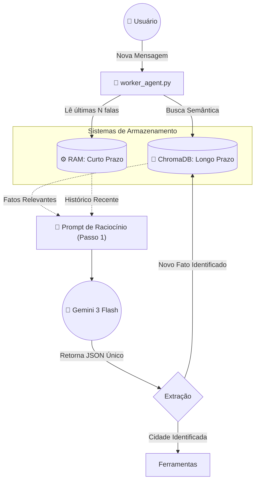

# 🧠 Memória Cognitiva e RAG: AgentBus

Este documento detalha a arquitetura do sistema de memória do AgentBus. Por padrão, Modelos de Linguagem (LLMs) são amnésicos (não lembram da interação anterior). Para transformar nosso Worker em um verdadeiro "Agente Cognitivo", implementamos um sistema de dupla camada de memória e utilizamos o padrão **RAG (Retrieval-Augmented Generation)** combinado com **Chamadas Unificadas**.

---

## 🧩 1. Visão Geral da Arquitetura de Memória

O sistema de memória atua como uma ponte entre o que o usuário disse agora e o que o sistema sabe sobre ele no passado. Ele se divide em dois pilares:
1. **Memória de Curto Prazo (Atenção):** Mantém o "fio da meada" da conversa atual. É volátil e rápida.
2. **Memória de Longo Prazo (Conhecimento):** Armazena fatos perenes e preferências do usuário. É persistente e utiliza busca semântica.

### 📊 Diagrama de Blocos (Mecanismo RAG + Extrator Unificado)



---

## 📦 2. Componentes do Sistema de Memória

### A. Memória de Curto Prazo (Dicionário em RAM)
- **Papel:** Lembrar do contexto imediato e manter o isolamento entre usuários da rede.
- **Funcionamento:** Um dicionário Python simples (`short_term_memory[USER_ID]`). Usa a técnica de "Janela Deslizante" (Sliding Window), enviando apenas as últimas 4 interações para não estourar o limite de tokens da API da IA e acelerar a inferência.
- **Ciclo de Vida:** Volátil. É apagada quando o serviço `worker_agent.py` é reiniciado. Em um ambiente de produção escalado, isso seria substituído por um *Redis*.

### B. Memória de Longo Prazo (Banco Vetorial)
- **Papel:** Lembrar quem é o usuário e suas preferências (ex: *"Odeia frio"*, *"Mora em Curitiba"*).
- **Funcionamento:** O LLM analisa o histórico e, utilizando um prompt estruturado (JSON), detecta se há um fato pessoal perene. Se houver, converte em *embeddings* e salva no banco de dados atrelado ao `USER_ID`.
- **Ciclo de Vida:** Persistente. Salvo fisicamente na pasta `/chroma_data` na raiz do projeto.

---

## 🔄 3. Fluxo de Processamento (RAG + Chamada Unificada)

**RAG** significa *"Geração Aumentada por Recuperação"*. É o ato de buscar dados em um banco e colá-los no prompt antes de mandar para a IA. Para economizar tokens e cotas (evitando o erro `429 RESOURCE_EXHAUSTED`), unificamos a extração de memória e a intenção de ação no mesmo passo.

Caminho percorrido quando o usuário (Lucas) pergunta: *"Acha que vou gostar da previsão de hoje? Moro em Tóquio."*

1. **Ingestão:** O `worker_agent` recebe a mensagem.
2. **Retrieval (Recuperação):** O agente faz uma busca semântica no `ChromaDB`. O banco encontra um fato antigo: *"O usuário Lucas odeia dias chuvosos"*.
3. **Augmentation & Raciocínio (Passo 1):** O agente junta o histórico e o texto atual em um prompt estruturado que exige um JSON de retorno. O Gemini analisa e devolve:
   ```json
   {
       "city": "Tóquio",
       "new_fact": "Mora em Tóquio"
   }
   ```
4. **Consolidação Direta:** O Worker salva imediatamente "Mora em Tóquio" no ChromaDB para o futuro e envia "Tóquio" para o MCP buscar o clima.
5. **Síntese (Passo 2):** O LLM processa o "super prompt" final:
   - *Fatos Recuperados:* Odeia dias chuvosos.
   - *Dados MCP:* A API de clima retornou "Chuva forte em Tóquio".
   - *Geração:* *"Como vai chover forte em Tóquio e você odeia dias chuvosos, acredito que não vai gostar muito."*
6. **Atualização da Janela:** A resposta final é anexada à Memória de Curto Prazo em RAM.

---

## 🛠️ 4. Stack Tecnológica de Dados

| Camada | Tecnologia | Propósito |
| :--- | :--- | :--- |
| **Banco Vetorial** | `ChromaDB` | Armazenamento de *embeddings* locais, *open-source* e sem necessidade de servidores externos na fase de desenvolvimento. |
| **State em RAM** | `dict` (Python) | Estrutura de dados nativa de altíssima velocidade para a janela de contexto de curto prazo. |

---

## 💡 5. Princípios de Design Aplicados

* **Eficiência de Rede (Single Pass Raciocínio):** A técnica de solicitar a cidade e a extração do fato no mesmo JSON reduz o tempo de latência total da resposta pela metade, além de evitar limites de cota da API.
* **Economia de Tokens:** Não enviamos o banco de dados inteiro para o LLM. A busca vetorial filtra apenas os top 3 fatos mais relevantes, mantendo o payload pequeno e a "atenção" do modelo focada.
* **Privacidade Local:** Usando o ChromaDB no modo persistente local (`./chroma_data`), a memória primária dos usuários não precisa ser enviada para bancos de dados gerenciados de terceiros.
* **Isolamento de Estado (Multitenancy):** A recuperação do banco vetorial e a janela de RAM são sempre consultadas passando o metadado `{"user": USER_ID}`, garantindo que o agente jamais vaze a memória de um usuário na conversa com outro.