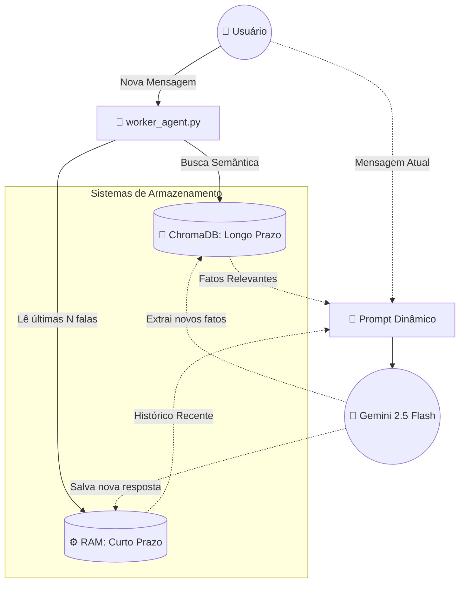

# 🧠 Memória Cognitiva e RAG: AgentBus

Este documento detalha a arquitetura do sistema de memória do AgentBus. Por padrão, Modelos de Linguagem (LLMs) são amnésicos (não lembram da interação anterior). Para transformar nosso Worker em um verdadeiro "Agente Cognitivo", implementamos um sistema de dupla camada de memória e utilizamos o padrão **RAG (Retrieval-Augmented Generation)**.

---

## 🧩 1. Visão Geral da Arquitetura de Memória

O sistema de memória atua como uma ponte entre o que o usuário disse agora e o que o sistema sabe sobre ele no passado. Ele se divide em dois pilares:
1. **Memória de Curto Prazo (Atenção):** Mantém o "fio da meada" da conversa atual. É volátil e rápida.
2. **Memória de Longo Prazo (Conhecimento):** Armazena fatos perenes e preferências do usuário. É persistente e utiliza busca semântica.

### 📊 Diagrama de Blocos (Mecanismo RAG)

---

## 📦 2. Componentes do Sistema de Memória

### A. Memória de Curto Prazo (Dicionário em RAM)
- **Papel:** Lembrar do contexto imediato (ex: entender que a pergunta *"E amanhã?"* refere-se à cidade mencionada na mensagem anterior).
- **Funcionamento:** Um dicionário Python simples (`short_term_memory[user]`). Usa a técnica de "Janela Deslizante" (Sliding Window), enviando apenas as últimas interações para não estourar o limite de tokens da API da IA.
- **Ciclo de Vida:** Volátil. É apagada quando o serviço `worker_agent.py` é reiniciado.

### B. Memória de Longo Prazo (Banco Vetorial)
- **Papel:** Lembrar quem é o usuário e suas preferências (ex: *"Odeia frio"*, *"Mora em Curitiba"*).
- **Funcionamento:** O LLM analisa cada fala do usuário. Se detectar um fato pessoal perene, ele o converte em *embeddings* (coordenadas matemáticas) e salva no banco de dados.
- **Ciclo de Vida:** Persistente. Salvo fisicamente na pasta `/chroma_data` na raiz do projeto.

---

## 🔄 3. Fluxo de Processamento (O Padrão RAG na Prática)

**RAG** significa *"Geração Aumentada por Recuperação"*. É o ato de buscar dados em um banco e colá-los no prompt antes de mandar para a IA. 

Caminho percorrido quando o usuário (Lucas) pergunta: *"Acha que vou gostar da previsão de hoje?"*

1. **Ingestão:** O `worker_agent` recebe a mensagem "Acha que vou gostar da previsão de hoje?".
2. **Retrieval (Recuperação):** O agente usa essa frase para fazer uma busca semântica no `ChromaDB`. O banco encontra um fato antigo matematicamente próximo: *"O usuário Lucas odeia dias chuvosos"*.
3. **Augmentation (Aumento):** O agente constrói o prompt final invisível juntando as peças:
   - *Instrução:* Você é um meteorologista.
   - *Fatos Recuperados:* O usuário odeia dias chuvosos.
   - *Histórico:* (Vazio ou últimas falas).
   - *Dados MCP:* A API de clima retornou "Chuva forte".
   - *Mensagem Atual:* "Acha que vou gostar da previsão de hoje?"
4. **Generation (Geração):** O LLM processa esse "super prompt" e deduz: *"Como vai chover forte e você odeia dias chuvosos, Lucas, acredito que não vai gostar muito."*
5. **Consolidação:** A resposta gerada e a pergunta inicial são anexadas à Memória de Curto Prazo para a próxima rodada.

---

## 🛠️ 4. Stack Tecnológica de Dados

| Camada | Tecnologia | Propósito |
| :--- | :--- | :--- |
| **Banco Vetorial** | `ChromaDB` | Armazenamento de *embeddings* locais, *open-source* e sem necessidade de servidores externos. |
| **State em RAM** | `dict` (Python) | Estrutura de dados nativa de altíssima velocidade para a janela de contexto de curto prazo. |

---

## 💡 5. Princípios de Design Aplicados

* **Economia de Tokens:** Não enviamos o banco de dados inteiro para o LLM. A busca vetorial filtra apenas os top 3 fatos mais relevantes para a pergunta atual, mantendo as chamadas de API baratas e rápidas.
* **Privacidade Local:** Usando o ChromaDB no modo persistente local (`./chroma_data`), os dados dos usuários não são enviados para bancos de dados de terceiros na nuvem.
* **Separação Cognitiva:** O fluxo de "raciocinar sobre a ferramenta MCP" e o fluxo de "lembrar do usuário" ocorrem em blocos separados no código, mantendo o agente modular.